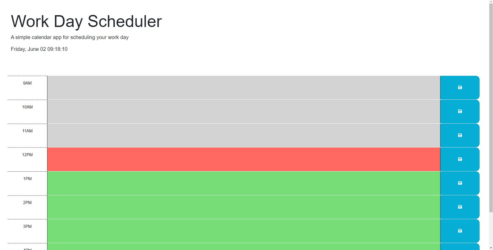

# Module-5-Challenge

## Description

My project is a calender web application for scheduling and journaling important information during the typical work hours of 9 am to 5 pm. I built this project to help users journal anything important during their work day. You can keep track of notes by each hour. 

I learned how to grab the date by using dayjs, and then use that date to make if statements. I learned all the different ways to format the date. I learned more about how to use local storage and how to store and get values.

## Table of Contents (Optional)

- [Installation](#installation)
- [Usage](#usage)
- [Credits](#credits)
- [License](#license)

## Installation

Load the webpage in any browser.
Here's a link to the webpage: https://brownkasey.github.io/Workday-Scheduler/

## Usage
The web application will store any information you choose at any hour you choose to save it at and any information saved can be overwritten with other information.

Head to the webpage: https://brownkasey.github.io/Workday-Scheduler/

On the webpage, it will show you different boxes for hours 9am to 5pm. Each box will have a color; grey, red or green. Grey boxes represent hours that have already passed, the red box represents the current hour of the day, and the green boxes represent the hours that haven't passed. If all the hour boxes are grey then it is outside of work hours.

You can click on any of the colored areas and will be able to take any notes within that area. Once you have typed the notes you wanted, you can click on the blue button with a save icon and it will save your notes for that hour.

*Important*
Something important to note is you have to click the save button on every hour you wanted to save the notes for!
The screenshot below shows how the webpage would look at if your time is 12 pm, to show an example of all the colored arears.

## Credits

Xander Rapstine:
https://github.com/Xandromus
https://github.com/coding-boot-camp/crispy-octo-meme

Xander provided the starter code for me to build upon.

## License
Refer to LICENSE in the repo.

---